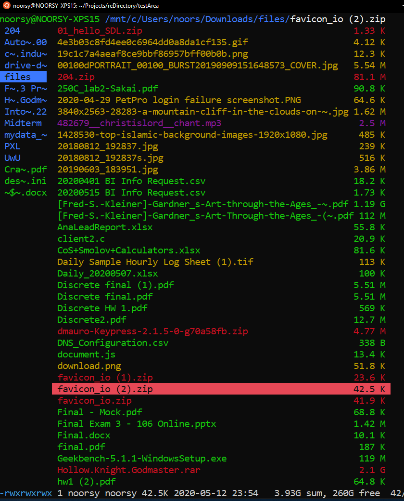
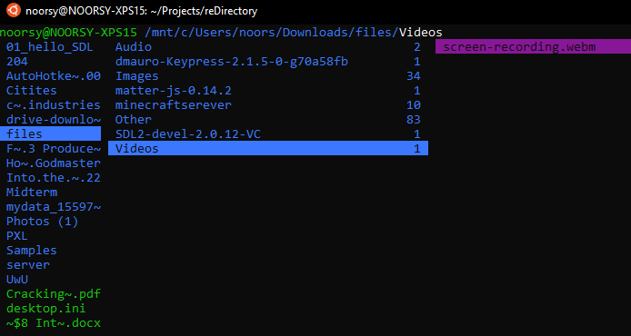

# reDirectory
CLI application to clean up messy directories. I made this because my downloads folder needed it.
Sorts files in a directory into subdirectories based on MIME file type standards. Currently supports the following catagorizations:
* Images
* Videos
* Audio
* Fonts
* Archives
* Other

Uses file magic number to determine file type, then sort into categories listed above. Real life use case below:

# BEFORE



# AFTER



# Installation
## Linux/ macOS
### Manual Installation:
1. install python3
2. install docopt
3. add reDirectory to PATH
### Cool Installation:
1. install python3
2. run install.

# Usage
```reDirectory <path to directory>```

